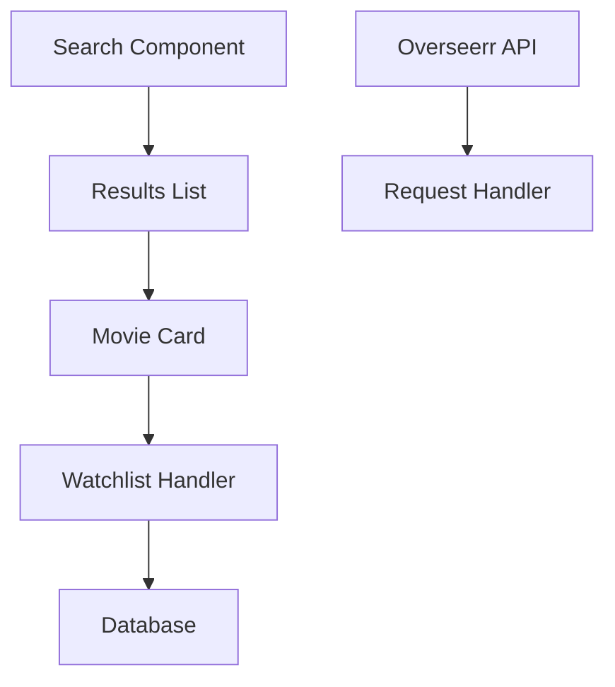

---
{"dg-publish":true,"permalink":"/readme/","tags":["gardenEntry"]}
---

# Movie Watchlist Documentation

## 🚀 Quick Access

| If you need to... | Go here |
|-------------------|---------|
| Set up the project | [Setup Guide](quick-start/setup.md) |
| Remember common commands | [Cheatsheet](quick-start/cheatsheet.md) |
| Understand how search works | [Movie Search](features/movie-search.md) |
| Work with the Overseerr API | [Overseerr Integration](features/overseerr.md) |

## The Big Picture

The Movie Watchlist app lets you:
- Track movies you want to watch
- Search for new movies
- Request movies through Overseerr

## Key Components

## Need Help?

If something isn't working:
1. Check the [Cheatsheet](quick-start/cheatsheet.md)
2. Look for relevant error messages
3. Ping your teammate on Slack
